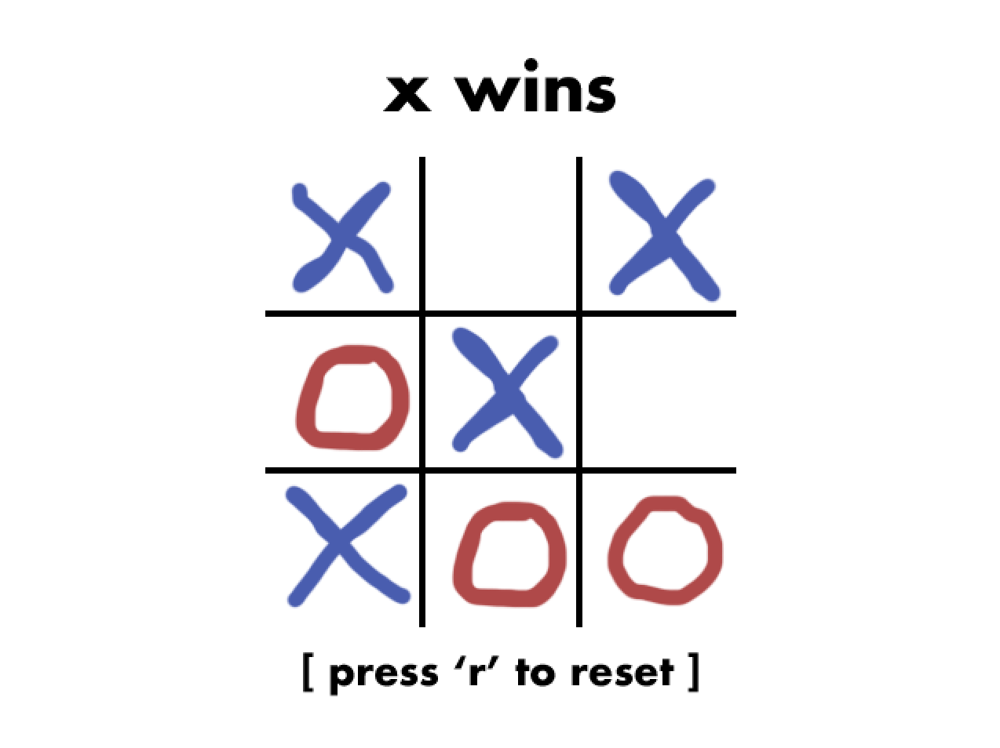

# ttt
A CLASSIC GAME.

# Description

A SIMPLE two-player tic tac toe game made with SIMPLE DirectMedia Layer.

All textures were made by me.

To play, use the mouse to click on the square you want to fill in. Press r when the game is over to play again. 

# Installation

This game will only work on Mac and Linux.

After downloading:
1. Extract the ttt-master folder.
2. Open a terminal window and cd to the folder containing the source files.
3. Use the command "make all".
4. Run the game with the command "./ttt".
